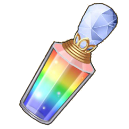

#  花嫁ブラウザ (HanaYome Browser)
### _A WIP browser for DMM webgame, Flower Knight Girl (フラワーナイトガール)_
> Since it is made by a newbee in NodeJS, any advices via new issues are welcome \_(:з」∠)\_  

## TODO
- [ ] a proxy server to listen for the game packets

## Current Progress
- [x] a independent and adaptive browser window using Chromium
- [x] automatically resizing the game view to fit the window
- [x] ignoring the alert by DMM token expiration
- [x] mutable audio
- [x] able to capture a screenshot into the clipboard
- [x] app icon

## Download executables
- [From Github](https://github.com/momocow/HanaYome/releases/latest)

## For developers
#### Download the source code
1. From github  
`git clone https://github.com/momocow/HanaYome.git`

#### Build
1. Build the JS application from Typescript source
`gulp build:app`  
> It will create a directory `app/` under your project root.

2. Build releases based on your platform
`gulp build:release`  
> It will create a directory `dist/` under your peoject root.
